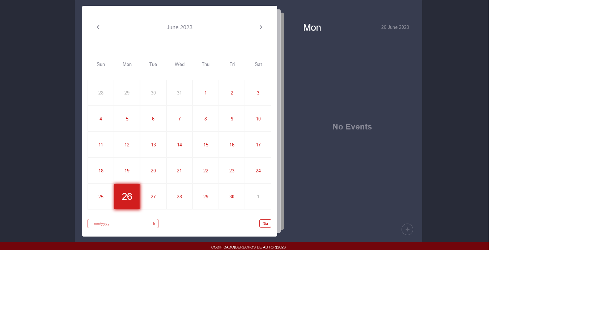

# Lista de Tareas de nodejs
# Calendario de Lista de Tareas

El Calendario de Lista de Tareas es una aplicación web diseñada para ayudarte a mantenerte organizado y productivo. Con esta herramienta, puedes administrar tus tareas diarias, establecer recordatorios importantes y realizar un seguimiento de tus actividades en un solo lugar.

## Características clave

- **Gestión de Tareas**: Crea y administra fácilmente tus tareas diarias. Puedes asignarles una descripción, una fecha de vencimiento y una prioridad para mantener un orden claro y enfocarte en lo más importante.

- **Vista de Calendario**: Visualiza tus tareas y eventos en un calendario mensual. Esta vista te permite planificar tu tiempo de manera eficiente y ver de un vistazo tus próximas actividades.

- **Recordatorios**: Configura recordatorios para tus tareas importantes. Nunca olvides una fecha límite o una reunión importante gracias a las notificaciones automáticas.

- **Interfaz Personalizable**: Personaliza la apariencia del calendario para adaptarlo a tus preferencias. Puedes elegir entre diferentes temas de color y estilos de visualización para que el calendario se ajuste a tu estilo personal.

- **Fácil de Usar**: La interfaz intuitiva y amigable facilita la navegación y la gestión de tus tareas. No se requieren conocimientos técnicos, por lo que cualquier persona puede comenzar a usarlo de inmediato.

## Beneficios para los usuarios

- **Organización Eficiente**: Con el Calendario de Lista de Tareas, puedes mantener todas tus tareas y eventos en un solo lugar, lo que te ayuda a organizar tu tiempo de manera eficiente y evitar la duplicación de esfuerzos.

- **Mayor Productividad**: Al tener una visión clara de tus tareas y recordatorios, puedes enfocarte en lo que realmente importa y completar tus actividades de manera más productiva.

- **Menos Estrés**: El calendario te ayuda a mantener un seguimiento de tus tareas y fechas límite, lo que reduce el estrés y te permite planificar tu tiempo de manera adecuada.

- **Flexibilidad y Adaptabilidad**: El calendario se adapta a tus necesidades y preferencias, lo que te permite personalizarlo según tu estilo y hacerlo funcionar para ti.

¡Comienza a utilizar el Calendario de Lista de Tareas hoy mismo y experimenta una mejor gestión del tiempo y una mayor productividad en tu vida!

Rama: review-3
